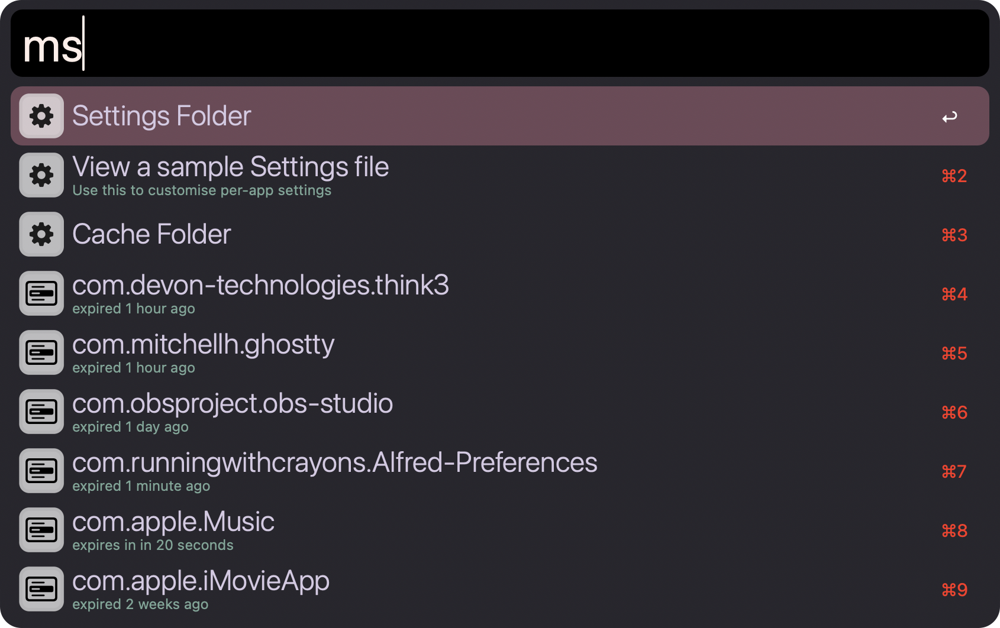

# Menu Bar Search Alfred Workflow

Search and action macOS app menu-bar items via Alfred

## Setup

- Enable “Accessibility” for Alfred in  
  **System Preferences → Security & Privacy → Privacy → Accessibility**.  
- Open the workflow’s Configuration (⌘+, on the workflow) to customize:
  - **Maximum items per menu**  
  - **Maximum sub-menu depth**  
  - **Show disabled menu items**  
  - **Include Apple  menu items**  
  - **Refresh cache on every new search**  
- For per-app overrides, type `ms` in Alfred to open the **Settings** folder, then edit `settings.txt` according to the sample.

## Usage

### Search Menu Items (`mu`)

Type `mu` followed by your query to list menu-bar items of the frontmost application.  
Supports fuzzy matching or exact prefixes.

Example: `mu cw` will match **Close Window** via fuzzy search

* <kbd>↩</kbd> Click the selected menu item

### Browse Folders (`ms`)

Type `ms` to open your workflow’s **Settings** and **Cache** folders:

* <kbd>↩</kbd> Open folder

## Caching

On first run the workflow builds a cache of menu items (this may take a few seconds).  
Subsequent searches are instantaneous. Control cache behavior in the Workflow Configuration or via your per-app `settings.txt`.

## Troubleshooting

If you see  
> Assistive applications are not enabled in System Preferences  
  
ensure Alfred is granted Accessibility in System Preferences → Security & Privacy → Privacy → Accessibility.

## Contribute & Support

Report bugs, request features or contribute on GitHub:  
https://github.com/philocalyst/Menu-Bar-Search
